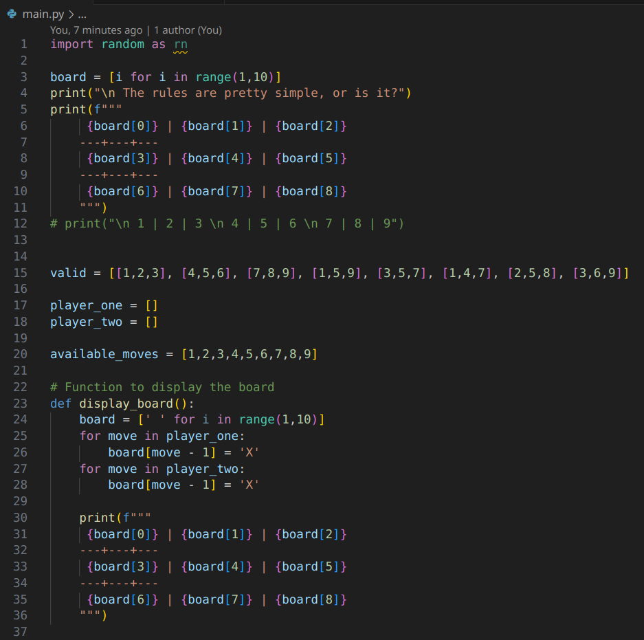
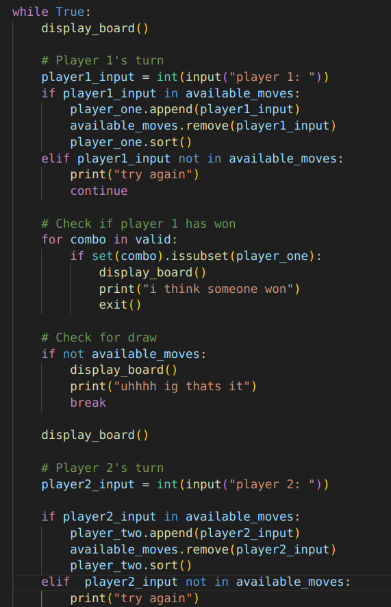
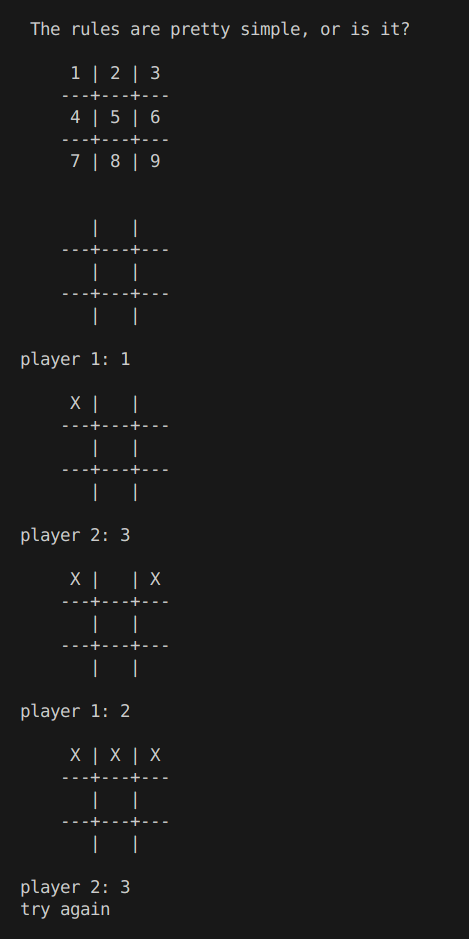

# Dork XOX

## Basic Details
### Team Name: Dilemma

### Team Members
- Team Lead: Muneer - SSET
- Member 2: Sharon - SSET

### Project Description
Tic Tac Toe but with a twist.

### The Problem (that doesn't exist)
Tic Tac Toe isn't fun enough, it is good and all but after a while the players will get bored. The moves will be easier to predict.

### The Solution (that nobody asked for)
Its pretty simple. There only 'X' in this game. for both players, their moves are indicated by 'X', this way the game will be hard to keep of and the players will eventually start to loose their minds. And the best part the would'nt let you know who really won. it'd just say "i think someone won" 

## Technical Details
### Technologies/Components Used
For Software:
- Python
- 
# Screenshots (Add at least 3)

## Team Contributions
- muneer: code
- sharon: idea
---
Made with ❤️ at TinkerHub Useless Projects 

